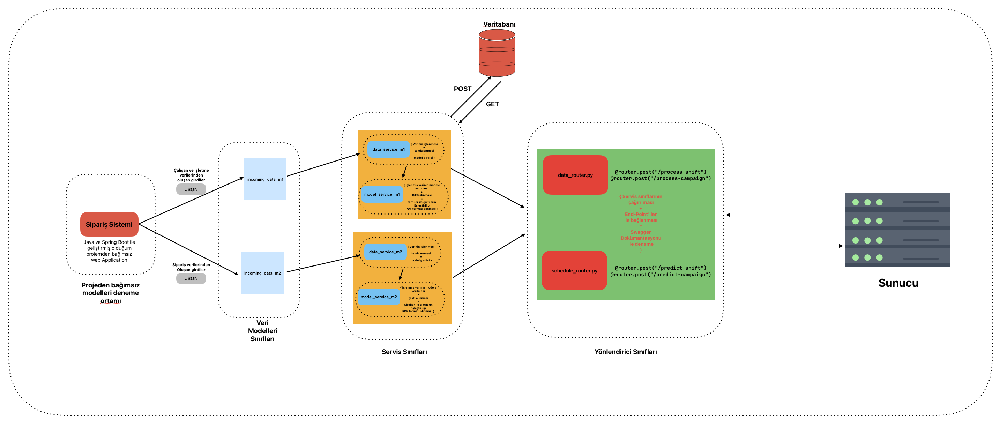
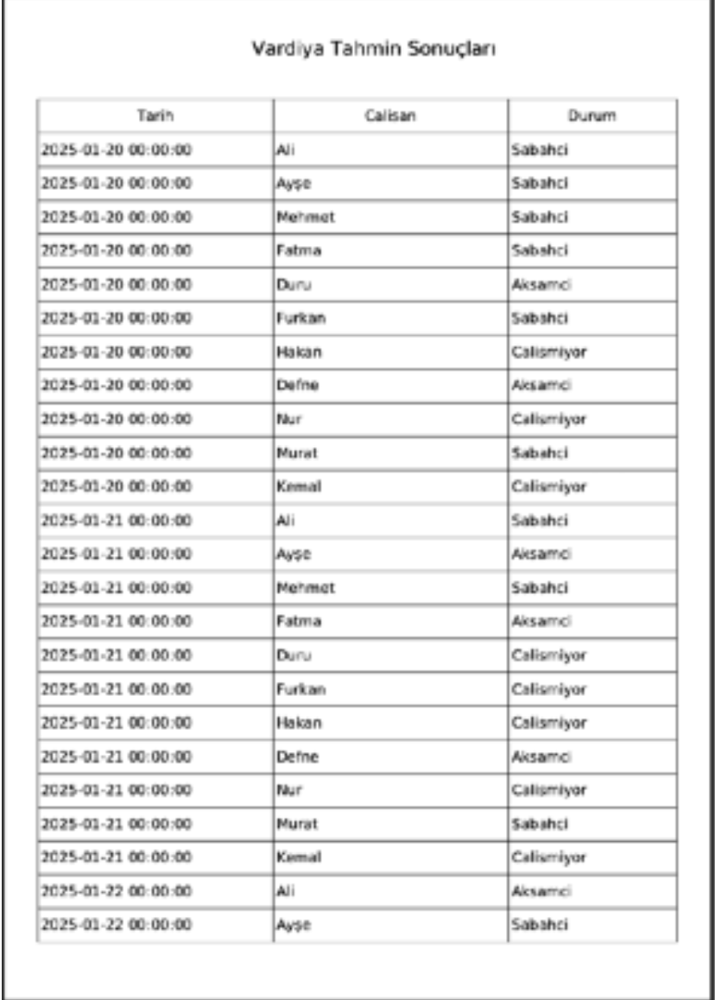
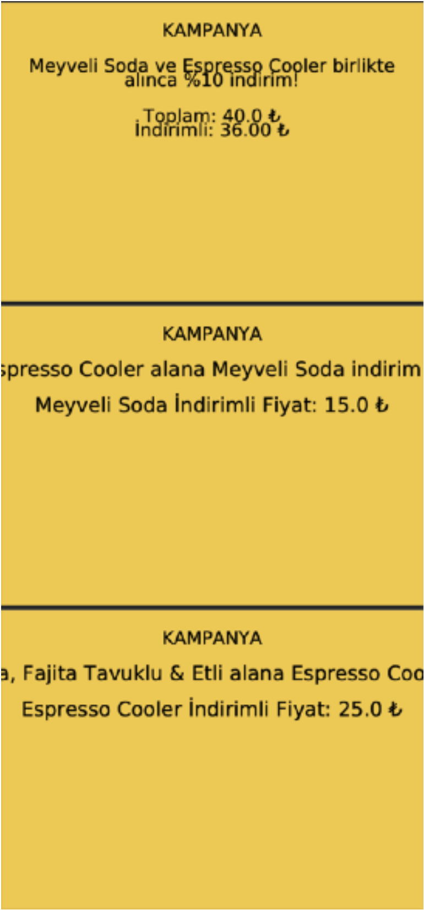

### **Artificial Intelligence Supported Order and Shift Management for Cafe & Restaurant Businesses**  

[](https://github.com/furkangonel/ml_shift-campaign_model/issues)  
[](https://github.com/furkangonel/ml_shift-campaign_model/stargazers)  
[](LICENSE)  


## **General Schema**

<p align="center">
  
</p>


**ML Shift & Campaign Model API** is an **Artificial Intelligence based API** developed to optimise **order management** and **employee shift planning** for cafe and restaurant businesses. 


## 📌 Description of the Project:
A simple AI-API that you can integrate into order systems used in cafe-restaurant operations. 
Parameters expected by the API,

# For Model_1;
```
    class IncomingData_Model1(BaseModel):
        date: datetime 
         name: str
         density_level: float  // average intensity for that day of the week
         work_type: str  //'fulltime' or 'parttime'
         preferred_shift: List[str] //one-hat-encoded as 'morning' or 'evening' (e.g. 1, 0 -> morning, 0, 1 -> evening)
         weekly_sales: float   // total sales made by the employee that week
         day_off_preferred: List[str]  // employee's leave preferences for that week (e.g. [Monday, Saturday])
```
   
# For Model_2;
```
    class Product(BaseModel):
        product: str
        price: float
        profit_margin: float
        quantity: int

    class IncomingData_Model2(BaseModel):
        order_id: int
        products: List[Product]
```

+ Shift estimator model (1st model) offers the opportunity to download the shift plan created for that week as a pdf according to the weekly information given.
+ Campaign forecasting model (2nd model) creates campaign forecasts in accordance with the rules of association according to the given past order data and presents the campaigns in pdf. (y %a discount for x product or total %a discount for x and y products together)


**OUTPUTS:**

## 🎯 Shift Tahmin Modeli
<p align="center">
  
</p>

## 🎯 Kampanya Tahmin Modeli
<p align="center">
  
</p>


**The two Classifier ML models in this project were trained independently of each other.**

**Model_1**: It was trained with business density, employee information-demands and result (target) data collected from enterprises and 66% success was obtained from the model as a result of the tests.

**Model_2**: The past order data in the enterprise was passed through the FP-Growth association algorithm and then these outputs were processed and used in the classification model training. As a result of this training, 95% accuracy was obtained.


| Model  | Explanation | Accuracy |
|--------|-------------|----------|
| **1. Model** | Employee shift prediction | **%66** |
| **2. Model** | Campaign prediction       | **%95** |


**1️⃣ Clone Project**
```sh
git clone https://github.com/furkangonel/ml_shift-campaign_model.git
cd ml_shift-campaign_model
```
**2️⃣ Install Required Dependencies**
```sh
pip install -r requirements.txt
```
**3️⃣ Run Project**
```sh
uvicorn main:app --reload
```
**4️⃣ API Documentation**

For Swagger UI documentation:
# 📌 http://127.0.0.1:8000/docs
# 📌 http://127.0.0.1:8000/redoc


**🛠️ Technologies Used**
#	- Python 🐍 - for backend development
#	- FastAPI 🚀 - API development
#	- MongoDB 🍃 - Database
#	- Scikit-learn 🤖 - Machine learning
#	- FP-Growth 📊 - Association analysis
#	- FPDF 📝 - PDF reporting
#	- Uvicorn ⚡ - API server


**📜 LICENSE**

This project is offered under the MIT Licence. For more information, see [LICENSE](LICENSE).